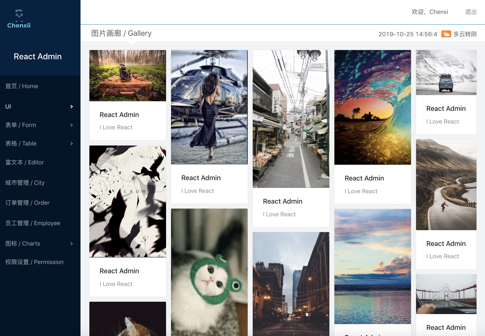
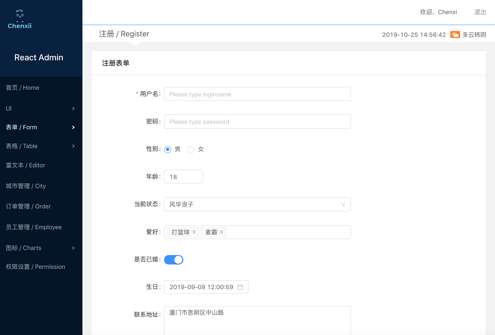
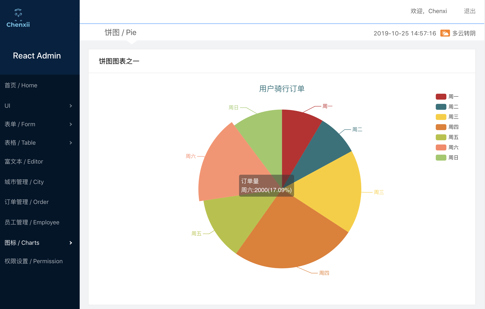

## 🌈 🐳 React Admin System

> 一个基于React全家桶制作的后台管理系统项目

[React-Admin | Heroku](https://admin-manager-react.herokuapp.com/) | 若一小时内若无访问，Heroku后台会自动睡眠，所以再次访问速度会慢些 | Heroku partitions according to resource requirements, if the application has not been accessed for a while, the program stops.

#### Preview | 预览









------

### 技术栈

- React：^16.9.0
- Redux：^4.0.4
- React-Redux：^7.1.1
- React-router-dom：^5.0.1
- Ant Design UI：^3.23.2
- Echarts：^4.2.1
- Echarts-for-react：^2.0.15-beta.0
- Axios：0.19.0
- Less：^2.7.3

------

### 本地运行

```
git clone https://github.com/ChenxiiCheng/React-Admin.git
cd React-Admin
npm install  // Or use yarn
npm run start  // yarn start
```
